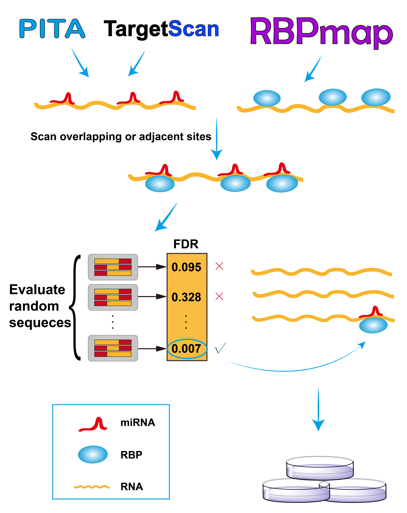
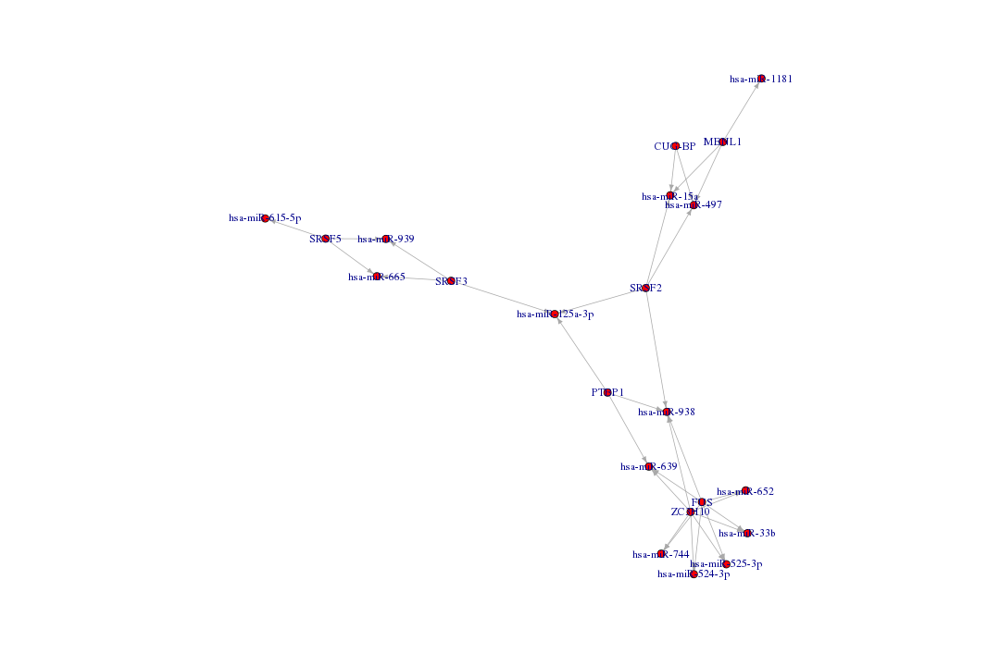

# RBPvsMIR
A Computational Pipeline to Identify Competing miRNAs and RNA-Binding Protein Pairs Regulating the Shared Transcripts

----------------------------
# Table of Contents
----------------------------

   * [Overview](#overview)
   * [Requirements](#Requirements)
   * [Command and subcommand structure](#command-and-subcommand-structure)
      * [pita](#pita)
      * [targetscan](#targetscan)
      * [union](#union)
      * [interaction](#interaction)
   * [Options](#Options)
   * [Usage](#Usage)
   * [Output](#Output)
   * [Note](#Note)
   * [References](#References)
   * [License](#license)


----------------------------
# Overview
----------------------------
Gene post-transcription regulation involves several critical regulators such as microRNAs (miRNAs) and RNA-binding proteins (RBPs). Accumulated experimental evidences have shown that miRNAs and RBPs can competitively regulate the shared targeting transcripts. Although this establishes a novel post-transcription regulation mechanism, there are currently no computational tools to scan for the possible competing miRNA and RBP pairs. Here, we developed a novel computational pipeline—RBPvsMIR—that enables us to statistically evaluate the competing relationship between miRNAs and RBPs. RBPvsMIR first combines with previously successful miRNAs and RBP motifs discovery applications to search for overlapping or adjacent binding sites along a given RNA sequence. Then a permutation test is performed to select the miRNA and RBP pairs with the significantly enriched binding sites. The workflow of RBPvsMIR is shown below.



----------------------------
# Requirements
----------------------------

The equitment which this software run on should fulfill conditions below:
1. CPU with more than 25 cores
2. memory more than 50G
3. hard disk more than 2T
4. Linux system（CentOS is recommended）
5. R, python and perl are also needed, and R package igraph should be installed
6. dependencies RBPmap, Pita and TargetScan should be installed in the main directory, links of these dependencies are shown below
```
RBPmap version 1.1: http://rbpmap.technion.ac.il/ (in RBPmap.pl, the path to the main directory under which the results sub-directories will be created should be set as '$results_dir = "./result/";')
Pita version 1.0: http://genie.weizmann.ac.il/pubs/mir07/mir07 data.html
TargetScan version 7.0: http://www.targetscan.org/vert_72/
```

----------------------------
# Command and subcommand structure
----------------------------

RBPvsMIR works with a command/subcommand structure:

```
python3 RBPvsMIR.py subcommand options

```

where the subcommand can be one of these:

- **pita**    :  Pita would be chosen as the algorithm to search the miRNAs binding sites
- **targetscan**    :  TargetScan would be chosen as the algorithm to search the miRNAs binding sites
- **union**    :  Pita and TargetScan would be used as the algorithms to search the miRNAs binding sites and the results would be combined
- **intersection**    :  Pita and TargetScan would be used as the algorithms to search the miRNAs binding sites and the results would be intersected


----------------------------
# Options
----------------------------

- **-r**  | **--rna**: RNA sequence, the length of RNA sequence should not be greater than 2000

- **-s**  | **--species**: species that the RNA is belonged to, ie. human, mouse

- **-d**  | **--distance**: distance between the RBP binding sites and miRNA binding sites, 100 is recommended

- **-p**  | **--p_value**: p-value RBPmap adopts for the result cutoff. 0.01 is recommended

- **-g**  | **--ddG**: energetic cutoff score, which is originally used by PITA to evaluate stability between the closed and open forms of miRNA-target duplex. -6 is recommended. if subcommand is targetscan, this option should be ignored

- **-f**  | **--fdr**: false discovery rate (FDR) used to control the rate of type I errors when conducting multiple testings. -0.05 is recommended


----------------------------
# Usage
----------------------------

```
python3 RBPvsMIR.py command -r <rna> -s <species> -d <distance> -p <p_value> [-g <ddG>] -f <fdr>
```

# Example
```
python3 RBPvsMIR.py pita -r ATATCCGCATT -s human -d 100 -p 0.05 -g -6 -f -0.05
```

----------------------------
# Output
----------------------------

Results consists of two presentations.A table list of the significant RBP and miRNAs pairs according to the user's parameter setttings. A interaction network of RBP and miRNA pairs (See below).


network.png

----------------------------
# Notes
----------------------------

Sequence length: the maximal is 2,000 bp. If you have longer sequences, please divide them into segments up to 2,000 bp long.  

Computational time: Since scaning the overlaping sites among RBPvsMIR involves extensive computations, it may take several days to complete the scaning job.  

----------------------------
# References
----------------------------

Benjamini, Y. and Hochberg, Y. (1995) Controlling the false discovery rate: A practical and powerful approach to multiple testing, J. R.Stat. Soc. B, 57, 289-300.  

Kertesz, M., et al. (2007) The role of site accessibility in microRNA target recognition, Nat Genet, 39, 1278-1284.  

Paz, I., et al. (2014) RBPmap: a web server for mapping binding sites of RNA-binding proteins, Nucleic Acids Res, 42, W361-367.  

Agarwal, V., et al. (2015) Predicting effective microRNA target sites in mammalian mRNAs. Elife.  

----------------------------
# License
----------------------------

RBPvsMIR is released under the MIT license.

